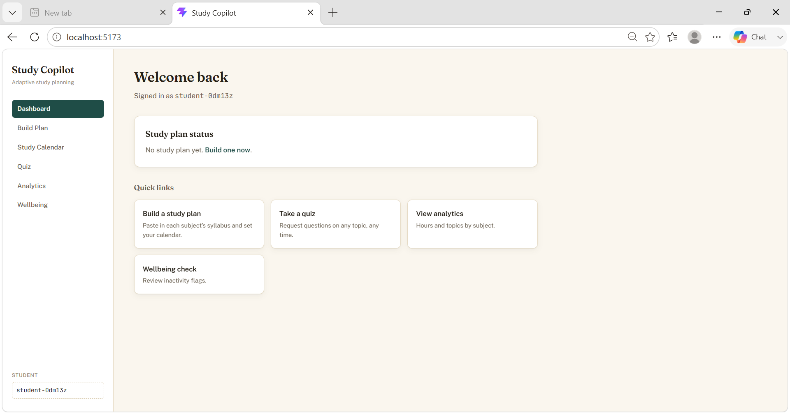
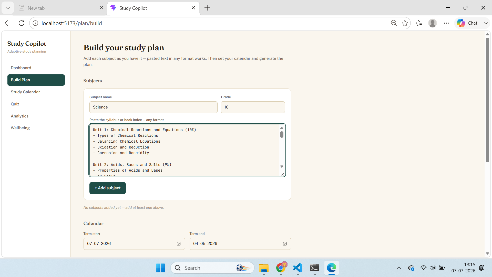
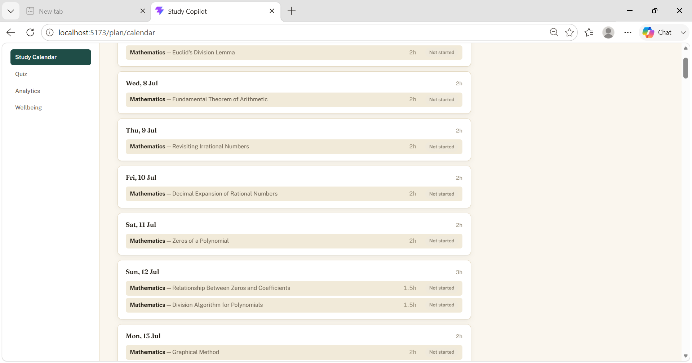
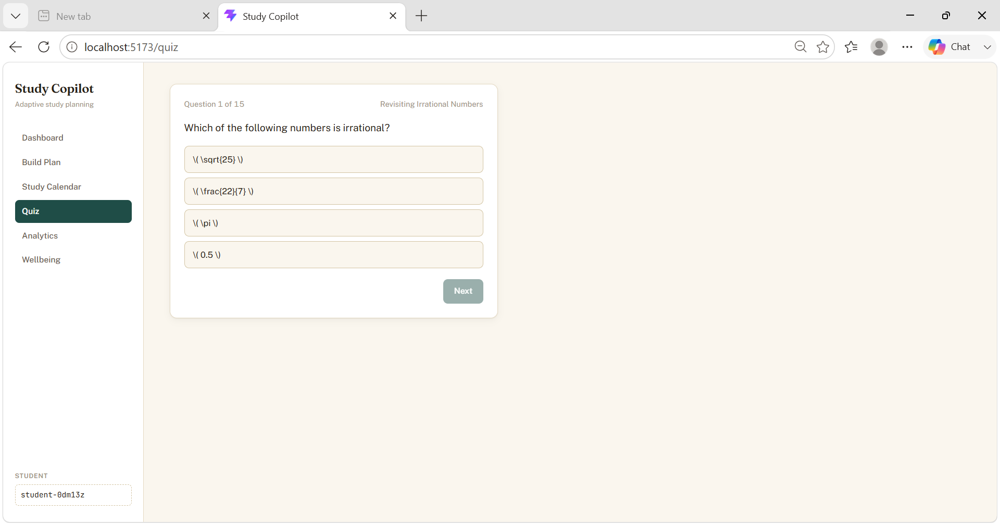
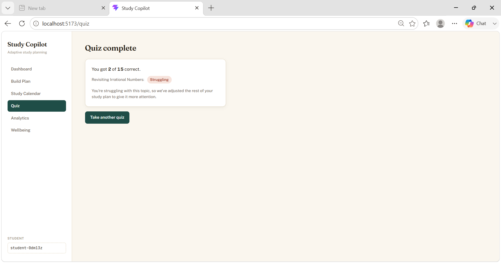
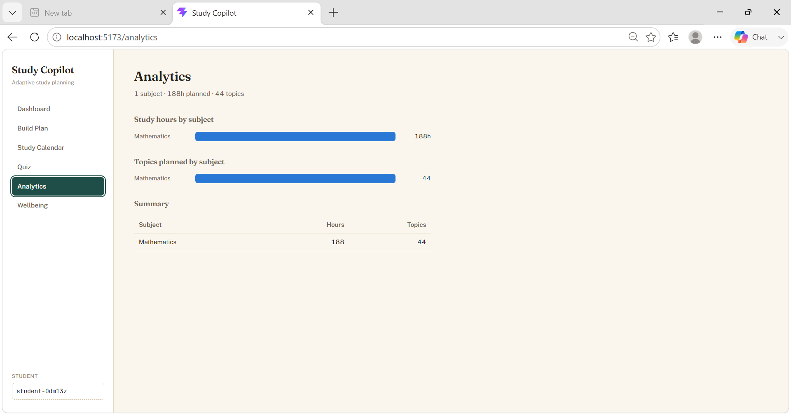
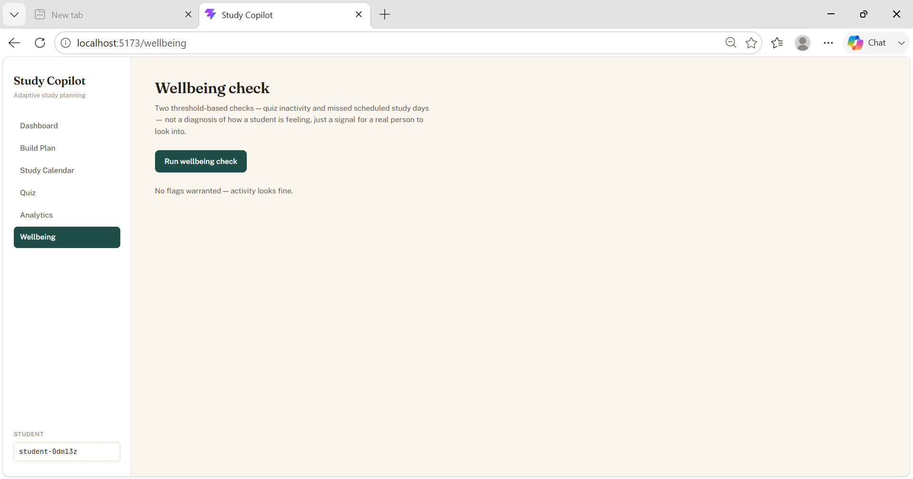

# Study Copilot — Adaptive Study Planning System

An AI-driven study planner for school students. A student pastes in each
subject's syllabus (however it's formatted — a clean list or a messy,
handwritten-style book index) and their term calendar; the system turns
that into a day-by-day, hour-budgeted study plan across every subject,
generates on-demand quizzes for any topic, tracks quiz performance into a
per-topic mastery status, automatically re-optimizes the remaining plan
when a topic is struggling, and runs a threshold-based inactivity check for
a parent/teacher to review.

The system is three parts: a CrewAI-based Python core with no server or UI
of its own, a FastAPI HTTP layer around it, and a React frontend. All three
are in this repository.

## Contents

- [Architecture](#architecture)
- [Project structure](#project-structure)
- [Setup](#setup)
- [Running everything](#running-everything)
- [The five AI crews](#the-five-ai-crews)
- [The syllabus intake path](#the-syllabus-intake-path)
- [HTTP API](#http-api)
- [Frontend](#frontend)
- [Testing](#testing)
- [Screenshots](#screenshots)

## Architecture

Three layers, from the ground up:

1. **`crewai_core/`** — a CrewAI `Flow` orchestrating five LLM-backed
   "Crews" (one agent + task each) plus plain deterministic Python for
   anything that must be reproducible and auditable rather than
   model-generated (grading, threshold checks, day/hour budget math). No
   server, no database — this package can run entirely from the command
   line.
2. **`backend/`** — a thin FastAPI layer around the Flow. Every mutating
   endpoint (`/plan`, `/quiz`, `/attempts`) returns `202 {job_id}`
   immediately and runs the actual work (which can take tens of seconds —
   these are real LLM calls) as a background job; callers poll
   `GET /jobs/{job_id}` for the result. State is in-memory per process (a
   student's `Flow` + an `asyncio.Lock` live in a plain dict), which is
   fine for local development but does not survive a process restart.
3. **`frontend/`** — a Vite + React + TypeScript single-page app that
   drives the whole flow: building a plan, viewing the generated calendar,
   taking quizzes, checking analytics, and reviewing wellbeing flags.

```
┌─────────────┐      HTTP (job-poll)      ┌──────────────┐      in-process       ┌──────────────────┐
│  frontend/  │ ────────────────────────▶ │  backend/    │ ────────────────────▶ │  crewai_core/     │
│  Vite+React │ ◀──────────────────────── │  FastAPI     │ ◀──────────────────── │  Flow + 5 Crews   │
└─────────────┘                           └──────────────┘                       └──────────────────┘
```

## Project structure

```
.
├── crewai_core/
│   ├── flow.py                    # StudyPlanFlow — the orchestrator
│   ├── performance_tracker.py     # plain-Python quiz grading + rollup logic
│   ├── wellbeing_monitor.py       # plain-Python inactivity threshold check
│   ├── run_flow.py                # CLI entrypoint (primary)
│   ├── run_syllabus_analyst.py    # standalone dev-runner (pre-Flow)
│   ├── run_academic_planner.py    # standalone dev-runner (pre-Flow)
│   ├── crews/
│   │   ├── syllabus_analyst/      # cleans up already-structured syllabus JSON
│   │   ├── syllabus_extractor/    # extracts a syllabus from raw pasted text
│   │   ├── academic_planner/      # parses the calendar + day/hour budget math
│   │   ├── plan_generator/        # builds one subject's day-wise plan slice
│   │   ├── assessment_designer/   # writes an on-demand quiz for one topic
│   │   └── plan_optimizer/        # re-plans remaining days when a topic is Struggling
│   ├── models/                    # every Pydantic model shared across crews/Flow/API
│   └── fixtures/                  # sample syllabi + calendar for local dev
├── backend/
│   ├── app.py                     # FastAPI app + CORS
│   ├── routes.py                  # every HTTP route
│   ├── registry.py                # in-memory {student_id: (Flow, Lock)}
│   ├── jobs.py                    # in-memory background job store
│   ├── errors.py                  # exception → HTTP status mapping
│   └── test_routes.py             # pytest suite (mocked LLM calls)
└── frontend/
    ├── src/
    │   ├── pages/                 # Dashboard, PlanBuilder, PlanCalendar, Quiz, Analytics, Wellbeing
    │   ├── components/             # layout, plan-builder forms, quiz UI, shared (JobStatus/ErrorBanner)
    │   ├── hooks/                  # useJobPoll, usePlan, useQuiz, useWellbeing
    │   └── lib/
    │       ├── api.ts              # thin fetch wrapper + ApiError
    │       ├── studentId.ts        # localStorage-based student identity (no real auth)
    │       └── schemas/            # zod schemas mirroring every backend Pydantic model
    └── docs/screenshots/           # see Screenshots section
```

## Setup

Requires [`uv`](https://docs.astral.sh/uv/) for the Python side and
Node.js 18+ for the frontend.

```bash
# Python core + backend
uv sync

# Copy and fill in your OpenAI key — every command below makes real LLM calls
cp .env.example .env
# edit .env: OPENAI_API_KEY=sk-...

# Frontend
cd frontend
npm install
cp .env.example .env   # VITE_API_BASE_URL=http://localhost:8000 (default is already correct)
cd ..

# Root dev-runner (starts backend + frontend together — see below)
npm install
```

Python >= 3.12 (`.python-version` pins 3.12). No pip/poetry — everything
goes through `uv`.

## Running everything

**One command, both servers** (uses [`concurrently`](https://www.npmjs.com/package/concurrently),
labeled/colored output per process):

```bash
npm run dev
# [backend]  → http://localhost:8000  (interactive API docs at /docs)
# [frontend] → http://localhost:5173
```

Or run each separately, in two terminals:

**Backend (FastAPI):**

```bash
uv run uvicorn backend.app:app --reload
# → http://localhost:8000  (interactive API docs at /docs)
```

**Frontend (Vite dev server):**

```bash
cd frontend
npm run dev
# → http://localhost:5173
```

Open `http://localhost:5173` — CORS is already configured for the Vite
dev origin. There is no login: the frontend generates a `student_id` in
`localStorage` on first visit (editable in the sidebar).

**CLI-only, no frontend** (the Flow can be driven directly):

```bash
uv run python -m crewai_core.run_flow
uv run python -m crewai_core.run_flow --quiz "Mathematics" "Polynomials"
uv run python -m crewai_core.run_flow --score-sample-attempt "Mathematics" "Polynomials" 0.8
uv run python -m crewai_core.run_flow --check-wellbeing
```

See `crewai_core/run_flow.py`'s module docstring for the full set of flags
and how they combine.

## The five AI crews

Each "Crew" is one CrewAI agent + task, invoked once per subject/topic
concurrently (never one call spanning every subject at once — that was
empirically too slow and error-prone). Every crew has a function-based
**guardrail** that validates its own output before it's accepted, forcing
up to 3 retries if it fails — this is the open-source substitute for
CrewAI Enterprise's `HallucinationGuardrail`.

| Crew | Runs | Purpose |
|---|---|---|
| `SyllabusAnalystCrew` | once per subject, from `@start()` inside the Flow | Restructures an **already-structured** syllabus (real JSON with units/topics) — cleanup only, never invents/drops content. |
| `SyllabusExtractorCrew` | on demand, before the Flow | Extracts a syllabus from **raw, unstructured text** — a pasted book index, any layout. See [The syllabus intake path](#the-syllabus-intake-path). |
| `AcademicPlannerCrew` | once per student | Parses the raw calendar JSON into a structured `CalendarStructure`. |
| `PlanGeneratorCrew` | once per subject | Builds that subject's day-wise plan slice against a pre-computed, plain-Python day/hour budget (`crews/academic_planner/scheduling.py`) — this budget step is what guarantees no two subjects are ever scheduled into the same hours on the same day. |
| `AssessmentDesignerCrew` | on demand, per (subject, topic) | Writes a 15–25 question multiple-choice quiz for exactly one requested topic. |
| `PlanOptimizerCrew` | on demand, once across **all** subjects | The one exception to "per-subject" — re-plans only the remaining (≥ today) days when a topic's rollup status becomes `Struggling`. The only crew with `memory=True`. |

Deterministic, non-LLM logic lives separately and is fully unit-testable:

- `crewai_core/performance_tracker.py` — grades a `QuizAttempt` and rolls
  up the last 5 attempts per topic into `Not Started` / `Struggling` /
  `Improving` / `Mastered`.
- `crewai_core/wellbeing_monitor.py` — flags when ≥ 7 real calendar days
  have passed since the student's last quiz attempt.
- `crewai_core/crews/academic_planner/scheduling.py` — the day/hour budget
  allocator described above.

## The syllabus intake path

There is exactly **one** path for getting a subject's syllabus into the
system: raw text in, a clean syllabus out, straight into the plan. There
is no separate "already organized" shortcut and no draft/review/confirm
step — every subject, regardless of how tidy the pasted text looks, goes
through the same `SyllabusExtractorCrew` conversion:

1. The student pastes a subject's syllabus/book index as **plain text** —
   any layout, any formatting, inconsistent numbering, whatever it is.
2. `SyllabusExtractorCrew` first checks whether the text's subject matter
   actually matches the declared subject name. If it doesn't (e.g. a
   history essay pasted under "Mathematics"), this is a **hard rejection**
   — the whole request fails with a `502` and a clear message, and nothing
   is built from it.
3. Otherwise, it extracts units → topics → sub-topics from the text's own
   heading/indentation structure, and works out each unit's weightage:
   look for a stated percentage first, and only fall back to an even split
   of the *remaining* percentage across units that didn't state one —
   never inventing a placeholder unit just to make the math add up (a real
   failure mode caught during development and closed with both a tightened
   prompt and an independent guardrail check).
4. A guardrail checks every extracted unit/topic/sub-topic actually has
   some plausible basis in the pasted text (catching outright invention,
   not demanding perfect fidelity on messy real-world formatting), and
   checks the weightage math is internally consistent.
5. The result is handed directly to the Flow as an already-clean syllabus.
   It is **not** re-run through `SyllabusAnalystCrew` — that crew's
   guardrail only makes sense against genuinely raw input; running it
   again on data this step already cleaned would just compare the output
   against itself and validate nothing.

## HTTP API

All routes are under `backend/routes.py`. `/plan`, `/quiz`, and `/attempts`
are real LLM calls and are job-polled — `POST` returns `202 {job_id}`
immediately; poll `GET /jobs/{job_id}` until `status` leaves `"pending"`.

| Method & path | What it does |
|---|---|
| `POST /students/{id}/plan` | Body: `{subjects: [{subject_name, grade, raw_index_text}], raw_calendar}`. Converts every subject's raw text, then kicks off the Flow. |
| `GET /students/{id}/plan` | Returns `{ready, study_plan}` synchronously (not job-polled) — `ready: false` means the Flow is still running. |
| `GET /jobs/{job_id}` | Poll target for any job. |
| `POST /students/{id}/quiz` | Body: `{subject, topic}`. Generates an on-demand quiz. |
| `POST /students/{id}/attempts` | Body: a `QuizAttempt`. Grades it, updates the topic's rollup status, and — if that status is now `Struggling` — triggers `PlanOptimizerCrew`. |
| `POST /students/{id}/wellbeing-check` | Plain threshold check, not job-polled — returns a flag or `null` immediately. |
| `POST /students/{id}/wellbeing-ack` | Body: `{flag_id, reviewer_note}`. Acknowledges a flag. |

Errors are mapped consistently (`backend/errors.py`):

| Status | Meaning |
|---|---|
| `404` | Unknown student or job. |
| `409` | Not ready yet (e.g. quiz requested before the plan finished). |
| `422` | Unknown subject/topic name. |
| `502` | A guardrail rejected the AI's output after exhausting retries — most commonly the syllabus-extractor's subject-mismatch/hallucination check. |

## Frontend

Vite + React 19 + TypeScript. No Next.js/SSR — a plain SPA is all this
needs. Key pieces:

- **`useJobPoll`** (`src/hooks/useJobPoll.ts`) — the one hook every
  job-backed action (`/plan`, `/quiz`, `/attempts`) is built on: fires the
  `POST`, then polls `GET /jobs/{id}` on an interval until the job leaves
  `"pending"`. Polling continues even if the browser tab is backgrounded
  (`refetchIntervalInBackground: true`) — jobs take real LLM-call time, and
  a student switching tabs mid-generation is the normal case, not an edge
  case.
- **zod schemas** (`src/lib/schemas/`) mirror every backend Pydantic model
  field-for-field, so a schema mismatch fails loudly at the API boundary
  instead of silently rendering `undefined`.
- **No real authentication** — `student_id` is generated and stored in
  `localStorage`, editable in the sidebar. This matches the backend, which
  has no auth of its own either.
- **Design system**: a warm, academic palette (paper/ink, not
  SaaS-blue-and-white) with Fraunces (display) + Public Sans (body) +
  JetBrains Mono (numbers/dates), fully themed for both light and dark
  mode. Chart colors in the Analytics page are a validated categorical
  palette (checked for colorblind-safe separation and contrast, not
  eyeballed).

Pages:

| Page | Route | What it does |
|---|---|---|
| Dashboard | `/` | Plan status + quick links. |
| Build Plan | `/plan/build` | Add subjects one at a time (name, grade, pasted syllabus text) to a pending list; fill in the full calendar (term dates, weekly hours, exams, deadlines, recurring activities, personal gaps); submit. |
| Study Calendar | `/plan/calendar` | Day-by-day view of the generated plan. |
| Quiz | `/quiz` | Request a quiz by subject/topic, take it with real per-question timing and retry tracking, submit, see the resulting mastery status. |
| Analytics | `/analytics` | Hours and topics planned per subject. |
| Wellbeing | `/wellbeing` | Run an inactivity check; acknowledge a flag with a note. |

## Testing

```bash
# Backend + crewai_core — 25 tests, no real LLM calls (Agent.execute_task is
# mocked but still runs the real Task/Crew/guardrail machinery)
uv run pytest -q

# One crew's guardrail logic in isolation
uv run pytest crewai_core/crews/syllabus_extractor/test_guardrails.py -v

# Frontend typecheck + build
cd frontend && npm run build
```

Each crew also has a `Crew.test()` eval script (real LLM calls, scored by
an eval model) for iterating on prompt quality:

```bash
uv run python -m crewai_core.crews.syllabus_extractor.test_crew [n_iterations]
uv run python -m crewai_core.crews.plan_generator.test_crew [n_iterations]
# ...one per crew, same pattern
```

## Screenshots

_Placeholders below — drop the corresponding PNG into
`frontend/docs/screenshots/` and each will render. Suggested capture: run
both dev servers, use a fresh `student_id`, build one small real plan
(1 subject, a few days), then walk through each page._

### Dashboard — empty state


### Build Plan — subject builder + calendar


### Study Calendar — generated plan


### Quiz — in progress


### Quiz — result


### Analytics


### Wellbeing — flagged

